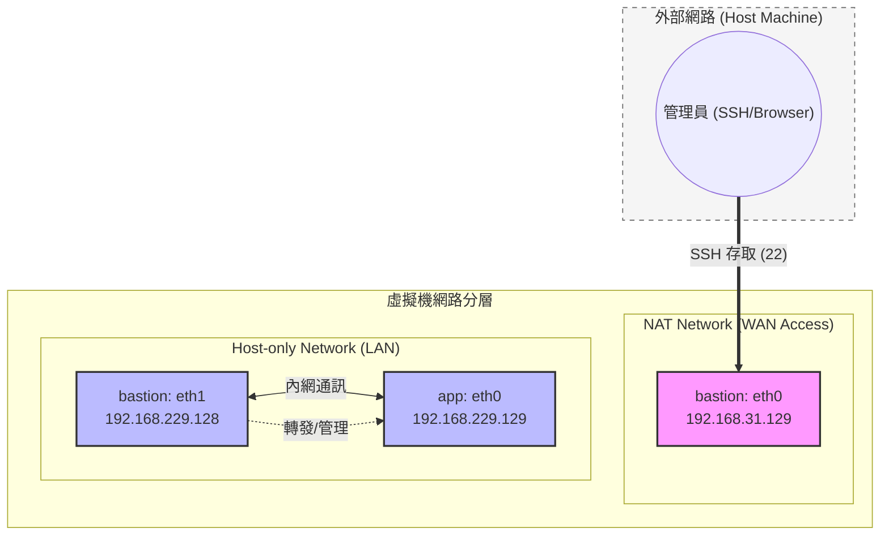
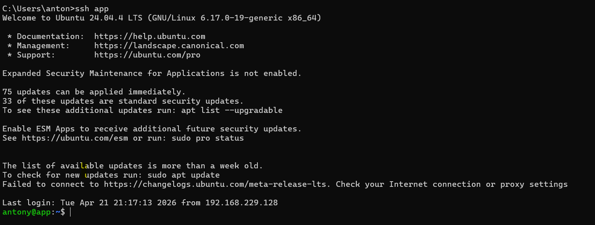
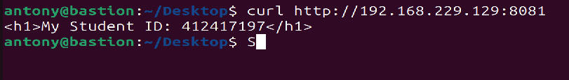
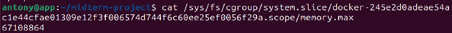

# 期中實作 — <412417197> <許家祥>

## 1. 架構與 IP 表
| VM      | 介面名稱         | IP 位址         |作用|
| ------- | ---------------- | --------------- | --- |
| bastion | eth0 (NAT)       | 192.168.31.129  |讓 Host 透過 SSH 連入|
| bastion | eth1 (Host-only) | 192.168.229.128 |與 app 通訊的內網 IP|
| app     | eth0 (Host-only) | 192.168.229.129 | 跑 Nginx 的內網 IP |



## 2. Part A：VM 與網路
bastion: `ping -c 3 192.168.229.129`
app: `ping -c 3 192.168.229.128`
```
--- 192.168.229.129 ping statistics ---
3 packets transmitted, 3 received, 0% packet loss, time 2006ms
--- 192.168.229.128 ping statistics ---
3 packets transmitted, 3 received, 0% packet loss, time 2059ms
```

## 3. Part B：金鑰、ufw、ProxyJump
App:
| 序號 | 目標埠號 (To) | 動作 (Action) | 來源 (From)      |
| ---- | ------------- | ------------- | ---------------- |
| [2]  | 22/tcp        | ALLOW IN      | 192.168.229.128  |


Bastion
| 序號 | 目標埠號 (To) | 動作 (Action) | 來源 (From)      |
| ---- | ------------- | ------------- | ---------------- |
| [1]  | 22/tcp        | ALLOW IN      | Anywhere |
| [1] | 22/tcp (v6)           | ALLOW IN       | Anywhere  (v6)         |



## 4. Part C：Docker 服務
systemctl status docker輸出
```bash=
antony@app:~/Desktop$ sudo systemctl status docker
● docker.service - Docker Application Container Engine
     Loaded: loaded (/usr/lib/systemd/system/docker.service; enabled; preset: e>
     Active: active (running) since Tue 2026-04-21 20:37:13 CST; 45min ago
TriggeredBy: ● docker.socket
       Docs: https://docs.docker.com
   Main PID: 1886 (dockerd)
      Tasks: 9
     Memory: 132.0M (peak: 133.8M)
        CPU: 1.320s
```
curl 輸出
```bash=
antony@bastion:~/Desktop$ curl -I http://192.168.229.129:8080
HTTP/1.1 200 OK
Server: nginx/1.29.6
Date: Tue, 21 Apr 2026 13:27:08 GMT
Content-Type: text/html
Content-Length: 896
Last-Modified: Tue, 10 Mar 2026 15:29:07 GMT
Connection: keep-alive
ETag: "69b038c3-380"
Accept-Ranges: bytes
```
## 5. Part D：故障演練
### 故障 1：F1
- 注入方式：在 app 執行 `sudo ip link set ens33 down`
- 故障前：Windows 執行 ssh app 成功登入；在 Bastion ping 192.168.229.129 有回應
- 故障中：
    - ip addr show ens33: ens33: <BROADCAST,MULTICAST> mtu 1500 qdisc fq_codel state DOWN group default qlen 1000
    - HOST:`channel 0: open failed: connect failed: No route to host stdio forwarding failed`
    - bastion: `--- 192.168.229.129 ping statistics ---
3 packets transmitted, 0 received, +3 errors, 100% packet loss, time 2061ms
`
- 回復後：在 app 執行 `sudo ip link set ens33 up`，連線恢復
- 診斷推論：因為 Ping 完全不通且回報 Unreachable，代表 L2/L3 鏈路層就斷了，封包根本找不到目標 MAC 地址或路徑

### 故障 2：F2
- 注入方式：在 app 執行 `sudo ufw default deny incoming` 且沒有 allow 22 的規則
- 故障前：ssh app 正常、ping 正常
- 故障中：
    - HOST: ssh app 出現 Connection timed out
    - Bastion: ping 192.168.229.129 正常
- 回復後：在 app 執行 `sudo ufw allow from 192.168.229.128 to any port 22 proto tcp`
- 診斷推論：雖然 SSH 同樣是 timeout，但 Ping 能通代表網路層  沒問題，封包進得去但被丟棄 ，這通常是防火牆的特徵
### 症狀辨識（若選 F1+F2 必答）
看 Ping 的結果： F1 Interface down 時 Ping 不會通；F2 ufw deny 時，若防火牆沒擋 ICMP，Ping 依然會通。

看 ARP 表格： 在 Bastion 執行 arp -n。若 F1 發生，該 IP 的 MAC 會變成 incomplete；若 F2 發生，MAC 地址依然存在，代表硬體層級找得到對方，只是應用層封包被拒

## 6. 反思（200 字）
在這次實作中，我深刻體會到「分層診斷」的重要性。以往看到 timeout 只會覺得是網路壞了，但透過 ip link 與 ufw 的對比實驗，我學會了先確認介面、再測Ping/ICMP、最後才查 Port/Firewall。

另外，ProxyJump 簡化了多層跳板的複雜度，但這也意味著 Bastion 的安全性至關重要，因為它是進入內網的唯一窄門。理解 timeout (被丟棄) 與 refused (被拒絕但有回應) 的細微差別，讓我在排錯時能更快定位是服務沒開還是被防火牆攔截。

## 7. Bonus（選做）
Bonus 1:
Dockerfile:
* `FROM nginx:alpine`: 定義基礎映像檔
* `COPY index.html /usr/share/nginx/html/index.html`: 當前目錄下的 index.html 複製到容器內的 Nginx 預設網頁路徑，覆蓋掉原有的頁面
* `EXPOSE 80`: 容器運行時會監聽 80 埠
docker history:
```
antony@app:~/midterm-project$ sudo docker history midterm-web
IMAGE          CREATED              CREATED BY                                      SIZE      COMMENT
e6bcd279301d   About a minute ago   EXPOSE [80/tcp]                                 0B        buildkit.dockerfile.v0
<missing>      About a minute ago   COPY index.html /usr/share/nginx/html/index.…   24.6kB    buildkit.dockerfile.v0
```



為什麼 COPY index.html 要放在 FROM 後面（快取考量）?
* FROM 是最底層，通常不會變動。Docker 會由上而下檢查每一行指令，如果指令內容與檔案沒有變動，它會直接使用 Cache

Bonus 2:

64m 在 cgroup 裡代表的是 67,108,864 bytes
