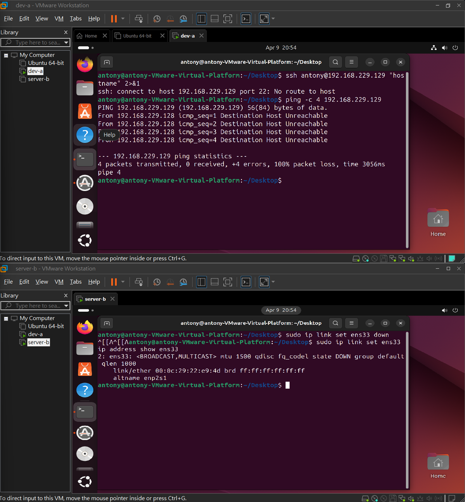
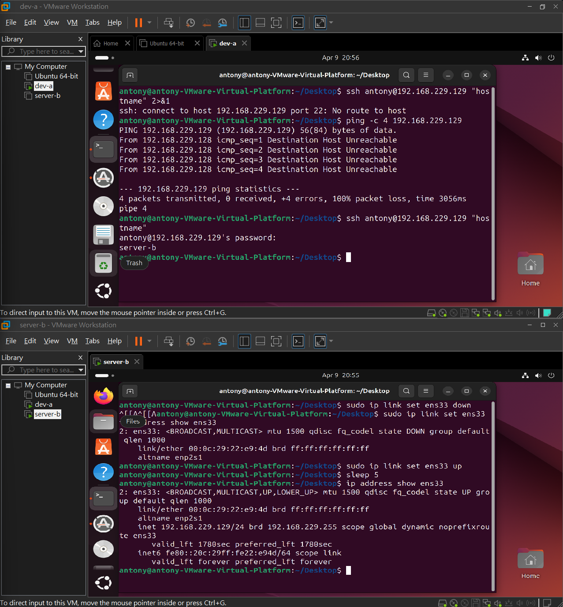
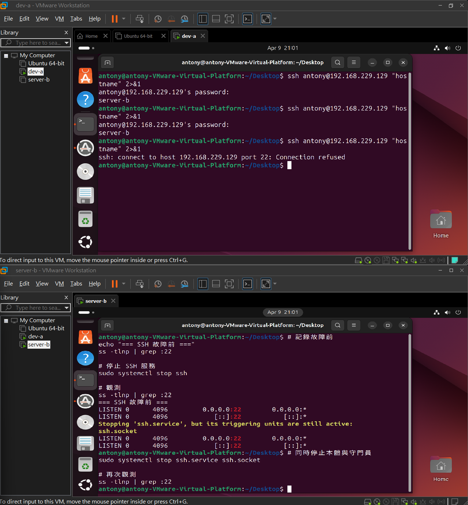
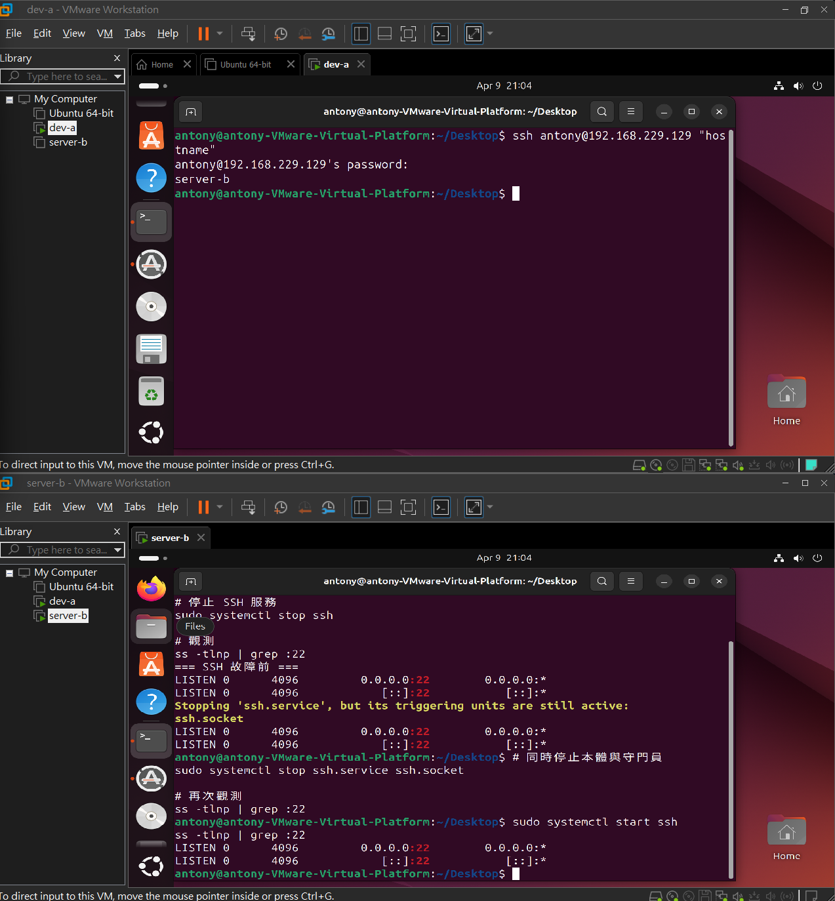
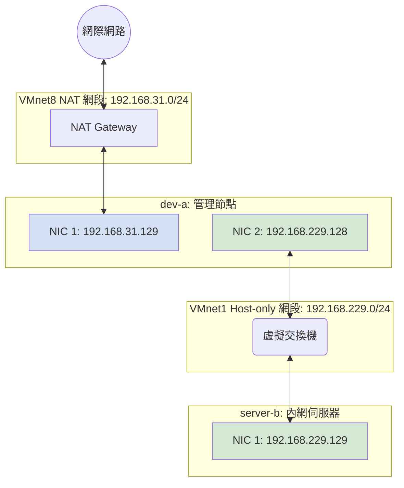
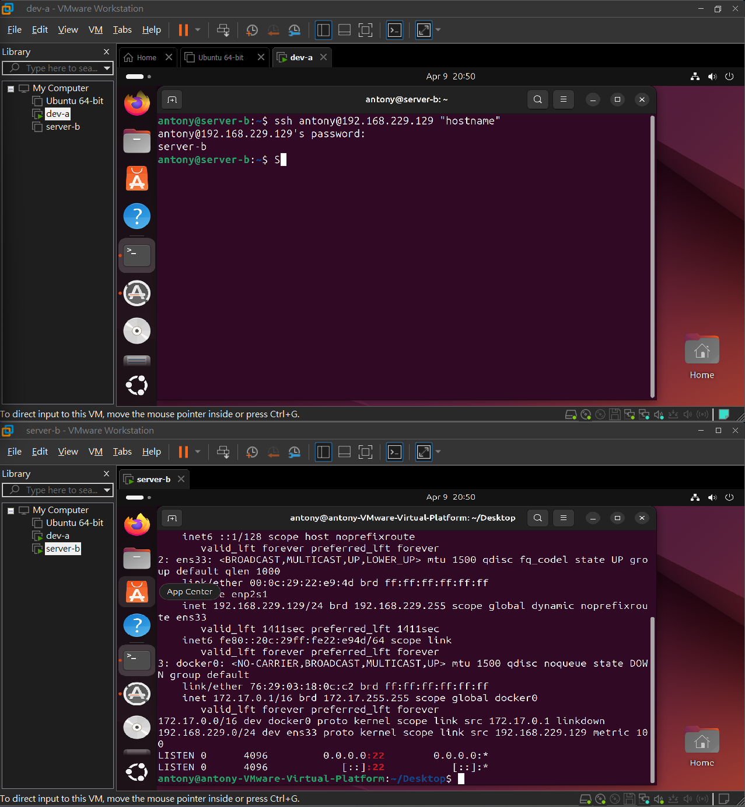

# W02｜VMware 網路模式與雙 VM 排錯

## 網路配置

| VM | 網卡 | 模式 | IP | 用途 |
|---|---|---|---|---|
| dev-a | NIC 1 | NAT | 192.168.31.129 | 上網 |
| dev-a | NIC 2 | Host-only | 192.168.229.128 | 內網互連 |
| server-b | NIC 1 | Host-only | 192.168.229.129 | 內網互連 |

## 連線驗證紀錄

- [x] dev-a NAT 可上網：`ping google.com` 輸出
- [x] 雙向互 ping 成功：貼上雙方 `ping` 輸出
- [x] SSH 連線成功：`ssh <user>@<ip> "hostname"` 輸出
- [x] SCP 傳檔成功：`cat /tmp/test-from-dev.txt` 在 server-b 上的輸出
- [x] server-b 不能上網：`ping 8.8.8.8` 失敗輸出

## 故障演練一：介面停用

| 項目 | 故障前 | 故障中 | 回復後 |
|---|---|---|---|
| server-b 介面狀態 | UP | DOWN | UP |
| dev-a ping server-b | 成功 | 失敗 | 成功 |
| dev-a SSH server-b | 成功 | 失敗 | 成功 |

## 故障演練二：SSH 服務停止

| 項目 | 故障前 | 故障中 | 回復後 |
|---|---|---|---|
| ss -tlnp grep :22 | 有監聽 | 無監聽 | 有監聽 |
| dev-a ping server-b | 成功 | 成功 | 成功 |
| dev-a SSH server-b | 成功 | Connection refused | 成功 |

## 排錯順序
L2 (Data Link - 資料連結層)：

檢查重點：網卡開了嗎？硬體（虛擬網卡）連上了嗎？

命令：`ip link show`

L3 (Network - 網路層)：

檢查重點：IP 有沒有抓到？網段對不對？閘道（Gateway）通不通？

命令：`ip address show、ip route show、ping <目標 IP>`

L4 (Transport - 傳輸層)：

檢查重點：對方的服務（Port 22）開了嗎？防火牆有沒有擋掉？

命令：`ss -tlnp、sudo ufw status`

## 網路拓樸圖
（嵌入或連結 network-diagram.png）

## 排錯紀錄
- 症狀：dev-a 無法 SSH 連線至 server-b，出現 No route to host 錯誤
- 診斷：在 dev-a 執行 ping -c 4 192.168.229.129，結果顯示 Destination Host Unreachable 。在 server-b 執行 ip address show ens33，發現介面狀態為 DOWN
- 修正：在 server-b 執行 sudo ip link set ens33 up 重新啟動網卡介面
- 驗證：在 server-b 確認 ip addr 重新取得 192.168.229.129。
    在 dev-a 再次測試 ssh 連線，成功看到 password 輸入提示並取得 server-b 的 hostname

## 設計決策
1. NAT / Bridged / Host-only 三種模式的差異摘要
這部分建議用你自己的理解描述，以下是幫你整理好的邏輯：

    Bridged (橋接模式)：VM 就像區網內的一台獨立實體機，與主機（Host）平級，直接向實體路由器拿 IP。優點是區網內其他電腦都能直接連進來，缺點是會佔用實體 IP，且安全性較低。

    NAT (網路地址轉換)：VM 躲在主機後面，透過主機的虛擬 NAT 裝置上網。VM 可以主動連出去，但外面（除主機外）連不進來。這是最穩定的上網模式，不會影響實體區網。

    Host-only (僅限主機)：完全切斷與外部實體網路的聯繫，僅允許 VM 與主機、或 VM 與 VM 之間互連。安全性最高，適合用於測試私有內網或不希望連網的資料庫伺服器。

2. 為什麼本週採用 NAT + Host-only 雙網卡設計？
理由：
我們模擬的是真實企業的「跳板機（Jump Server）與內網伺服器」架構。

    dev-a (雙網卡)：擔任管理節點。NAT 讓它能下載套件、更新系統；Host-only 讓它能連入內部私有網域。

    server-b (單網卡)：擔任受保護的伺服器。僅配置 Host-only 介面，是為了達到網路隔離。即使 server-b 有漏洞，攻擊者也無法直接透過外網連入，也防止 server-b 的資料外洩到網際網路。
