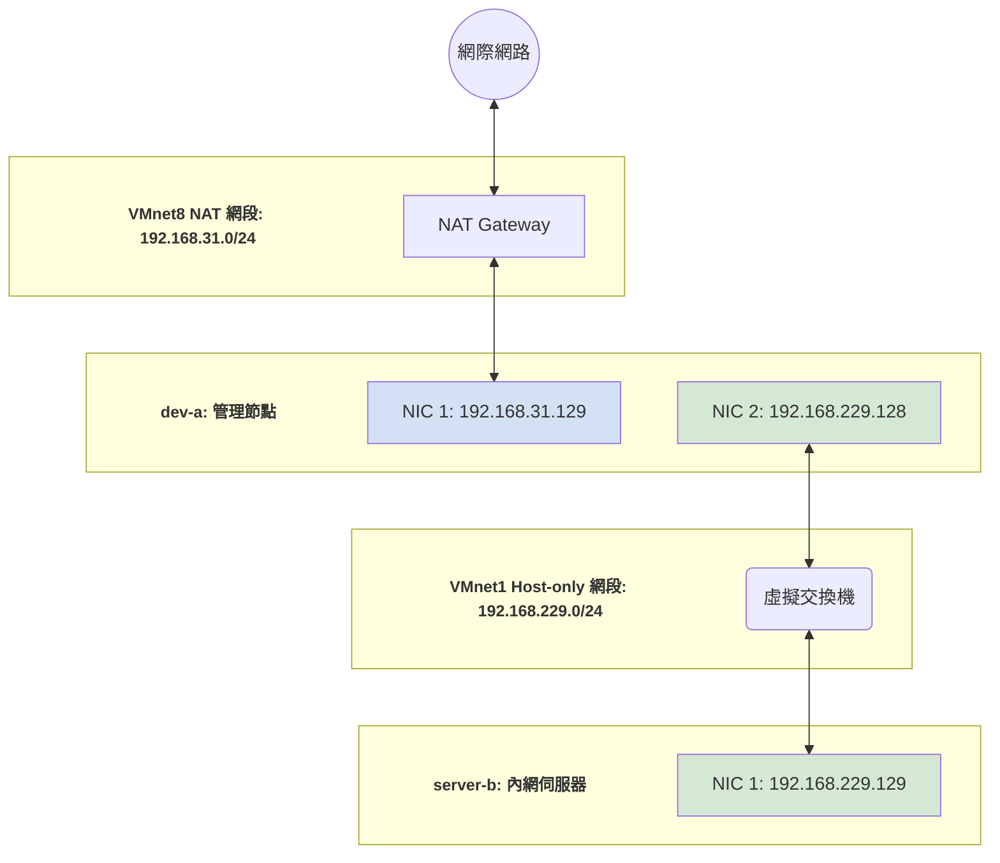

    

```mermaid
graph TD
    Internet((網際網路))

    subgraph VMnet8 [ ]
        T1[<b>VMnet8 NAT 網段: 192.168.31.0/24</b>]
        NAT_GW[NAT Gateway]
    end

    subgraph DEVA [ ]
        T2[<b>dev-a: 管理節點</b>]
        NIC1[NIC 1: 192.168.31.129]
        NIC2[NIC 2: 192.168.229.128]
    end

    subgraph VMnet1 [ ]
        T3[<b>VMnet1 Host-only 網段: 192.168.229.0/24</b>]
        Internal_Switch(虛擬交換機)
    end

    subgraph SERVB [ ]
        T4[<b>server-b: 內網伺服器</b>]
        NIC3[NIC 1: 192.168.229.129]
    end

    Internet <--> NAT_GW
    NAT_GW <--> NIC1
    NIC2 <--> Internal_Switch
    Internal_Switch <--> NIC3

    %% 樣式設定：讓標題節點看起來不像按鈕
    style T1 fill:none,stroke:none,font-size:14px
    style T2 fill:none,stroke:none,font-size:14px
    style T3 fill:none,stroke:none,font-size:14px
    style T4 fill:none,stroke:none,font-size:14px
    
    %% 原本的網卡顏色
    style NIC1 fill:#d4e1f5
    style NIC2 fill:#d5e8d4
    style NIC3 fill:#d5e8d4
```
