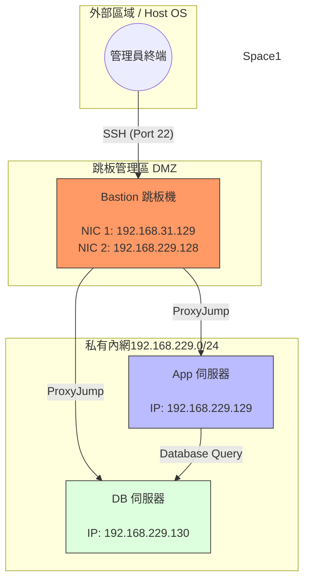

# W03｜多 VM 架構：分層管理與最小暴露設計

## 網路配置

| VM | 角色 | 網卡 | 模式 | IP | 開放埠與來源 |
|---|---|---|---|---|---|
| bastion | 跳板機 | NIC 1 | NAT | 192.168.31.129 | SSH from any |
| bastion | 跳板機 | NIC 2 | Host-only | 192.168.229.128 | — |
| app | 應用層 | NIC 1 | Host-only | 192.168.229.129 | SSH from 192.168.56.0/24 |
| db | 資料層 | NIC 1 | Host-only | 192.168.229.130 | SSH from app + bastion |

## SSH 金鑰認證

- 金鑰類型：（例：ed25519）
- 公鑰部署到：（例：app 和 db 的 ~/.ssh/authorized_keys）
- 免密碼登入驗證：
  - bastion → app：（貼上輸出）
  - bastion → db：（貼上輸出）

## 防火牆規則

### app 的 ufw status


### db 的 ufw status


### 防火牆確實在擋的證據
```
curl -m 5 http://192.168.229.129:8080
curl: (28) Connection timed out after 5002 milliseconds
```


## ProxyJump 跳板連線
- 指令：
    ```
    nano ~/.ssh/config

    Host bastion
        HostName 192.168.31.129
        User antony

    Host app
        HostName 192.168.229.129 
        User antony
        ProxyJump bastion

    Host db
        HostName 192.168.229.130
        User antony
        ProxyJump bastion
    ```
- 驗證輸出：
    ```
    # 在 Host OS 建立測試檔
    echo "Jump test" > proxy-test.txt


    $ scp proxy-test.txt db:/tmp/


    $ ssh db "cat /tmp/proxy-test.txt"
    This is a test file from Host
    ```
    

- SCP 傳檔驗證：

    


## 故障場景一：防火牆全封鎖

| 項目 | 故障前 | 故障中 | 回復後 |
|---|---|---|---|
| app ufw status | active + rules | deny all | status active |
| bastion ping app | 成功 | 100% packet loss | 成功 (0% loss, rtt ~0.5ms) |
| bastion SSH app | 成功 | **timed out** | 成功 (可正常登入) |

## 故障場景二：SSH 服務停止

| 項目 | 故障前 | 故障中 | 回復後 |
|---|---|---|---|
| ss -tlnp grep :22 | 有監聽 | 無監聽 | 有監聽 |
| bastion ping app | 成功 | 成功 | 成功 |
| bastion SSH app | 成功 | **refused** | 成功 |

## timeout vs refused 差異
Timeout：你對某人喊話，但對方完全沒回應，連個「不」字都沒說。你等了很久（例如 5 秒），最後只好放棄。封包（Packet）在傳輸過程中被**丟棄（Drop）**了。你的請求可能根本沒到達目的地，或者到達了但被擋下且不給予任何回應。

Connection Refused：你去敲門，對方立刻隔著門大喊：「我現在不方便，別進來！」這代表門（伺服器）還在，但它明確拒絕提供這項服務。 封包成功抵達了目標 IP，但目標主機的回應是「該 Port 沒有程式在監聽」。系統會回傳一個 RST (Reset) 封包告訴你：這裡沒人在家。

## 網路拓樸圖




## 排錯紀錄
- 症狀： 在 Host OS 執行 ssh app 時，連線中斷並報錯 Temporary failure in name resolution。

- 診斷： 首先檢查 ~/.ssh/config，發現 Host app 下方的 HostName 填寫的是別名 app 而非 IP。由於 Bastion 無法解析 app 這個字串，導致轉發失敗。

- 修正： 將 ~/.ssh/config 中的 HostName app 修改為實際的內網 IP 192.168.229.129。

- 驗證： 再次執行 ssh app "hostname"，成功穿透跳板並回傳 app 字樣

## 設計決策
* 為什麼 DB 允許 Bastion 直連，而不僅限於 App？

    雖然從 App 連 DB 最安全，但管理員（Bastion）需要進行資料庫備份、結構遷移 (Migration) 或緊急修復。若 App 壞掉時 Bastion 也連不進 DB，會導致無法維修。這是在「極致安全」與「可維護性」之間取得平衡

* 為什麼使用 Ed25519 演算法而非 RSA？

    Ed25519 的金鑰長度較短（方便複製貼上），且運算效率與安全性在現代標準中都優於老舊的 RSA。
