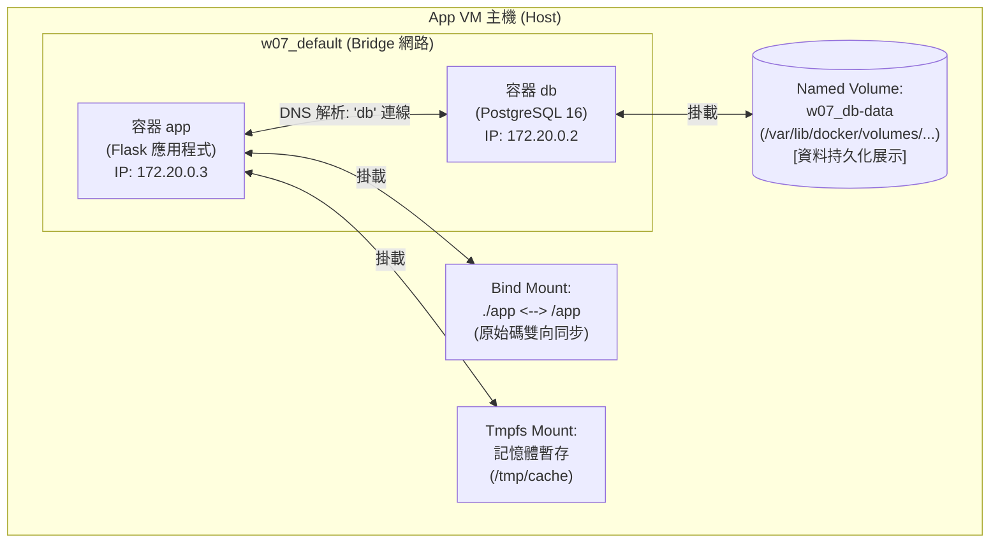

# W07｜Docker Compose 與資料持久化

## 拓樸圖

## 從 docker run 到 compose.yaml
在先前的命令式（Imperative）部署中，必須依序手動敲入建立網路、建立 Volume 以及多條帶有大量環境變數的 docker run 指令。這種做法非常容易因為筆記漏抄、指令順序顛倒（如網路未建就起容器）或密碼散落各處而導致部署失敗。

改用 Docker Compose 這種宣告式（Declarative）工具後，最大的改善在於「基礎設施即程式碼（IaC）」的重現性。只要寫好一份 compose.yaml，團隊成員只需透過 git clone 搭配一條 docker compose up -d，Compose 就會自動接管網路建立、依賴順序排列、環境變數帶入與現場清理。這將原本散落、脆弱的部署步驟，轉化為一份可以被版本控管、保證最終狀態一致的設定檔。

## 三種掛載對照
| 掛載類型 | 路徑（host） | 容器砍重起資料還在嗎 | 重啟容器資料狀態 | 適合情境 |
|---|---|---|---|---|
| named volume | /var/lib/docker/volumes/w07_db-data/_data | 在 （除非執行 docker compose down -v 或手動刪除 volume） | 資料完好如初，新容器會自動接回舊資料 | 生產環境（Prod）的資料庫、需要跨主機遷移或不需要關心 host 具體路徑的資料持久化。 |
| bind mount | ./app （由使用者在 host 上指定的絕對或相對路徑） | 在 （資料儲存於 host 上，不受容器生命週期影響） | 資料完好如初，且 host 與容器內雙向即時同步 | 開發環境（Dev）的原始碼掛載，在主機修改程式碼能即時在容器內生效，免去重複 build image 的時間。 |
| tmpfs | 不落地（直接掛載於主機的實體記憶體 RAM 中） | 不在 （容器停止或重啟後，記憶體即被釋放） | 資料完全清空，回復到最初的初始狀態 | 敏感暫存資料（如暫存金鑰、Token）、超高併發的微量短命快取（Cache），確保不留痕跡於硬碟中。 |

## healthcheck 前後對照
| 寫法 | curl /healthz t=1s | t=3s | t=5s | t=10s |
|---|---|---|---|---|
| 只 depends_on | 503 Service Unavailable | 503 Service Unavailable | 503 Service Unavailable | 200 OK |
| service_healthy | Connection refused | Connection refused | 200 OK | 200 OK |

1. 只使用 depends_on：當容器啟動時，app 與 db 容器會同時或在極短時間內先後建立。此時 app 的網頁伺服器已經準備好監聽連線，但 PostgreSQL 內部仍需要 5~8 秒的時間進行初始化與連線準備。因此在前幾秒打 curl 時，會由 app 回傳連不上資料庫的 503 錯誤訊息。

1. 搭配 service_healthy：Compose 會強制攔截 app 的啟動流程，直到 db 容器的健康檢查指令（pg_isready）回傳成功。因此在 t=1s 到 t=3s 期間，因為 app 容器尚未被建立，主機的 8080 port 沒有任何服務在監聽，故連線直接被拒絕（Connection refused）。一旦 app 被放行啟動，代表資料庫已經百分之百就緒，因此第一次連線就直接拿到 200 OK，完全避免了中途的異常噪音。

## 排錯紀錄
- 症狀：修改了 compose.yaml 中 app 的環境變數或通訊埠（ports）對應後，執行 docker compose restart app，發現新的設定完全沒有生效。
- 診斷：查閱 Docker 官方規格發現，restart 指令僅僅是向容器內的 1 號進程（PID 1）發送停止與啟動訊號，它不會重新讀取或解析 compose.yaml 設定檔，也不會重建容器。
- 修正：應改用 docker compose up -d 指令。
- 驗證：執行 docker compose up -d 後，終端機顯示 Recreating w07-app-1 ... done，Compose 自動比對設定檔變更並精準重建了該服務，再次驗證設定已成功套用。

## 設計決策
* 為什麼 db 用 named volume 而不是 bind mount？

    1. 權限與相容性問題：資料庫（如 PostgreSQL）對底層資料夾的權限（UID/GID）、Locale 擁有嚴格要求。若使用 bind mount，容器內常會因 host 端目錄權限不符而噴出 Permission denied 或無法初始化。
    1. 環境隔離與可攜性：Named volume 將目錄的管理權完全交還給 Docker Engine，開發者不需要在 host 事先手動建立特定目錄，這使得這份 compose.yaml 無論拿到 Linux、Mac (UTM) 還是 Windows 環境都能直接執行，維持高度的一致性。

* 為什麼不能在生產用 tmpfs 存資料庫？
    1. 資料庫的核心使命是滿足 ACID 中的「持久性（Durability）」，確保資料一經寫入就不會因任何意外而損毀。tmpfs 將所有資料都鎖在揮發性的記憶體（RAM）當中，只要容器發生非預期重啟、主機斷電、或是維護性關機，所有線上使用者的資料將會在瞬間化為烏有且無法挽回。因此生產環境絕對不可使用 tmpfs 存放資料庫。
